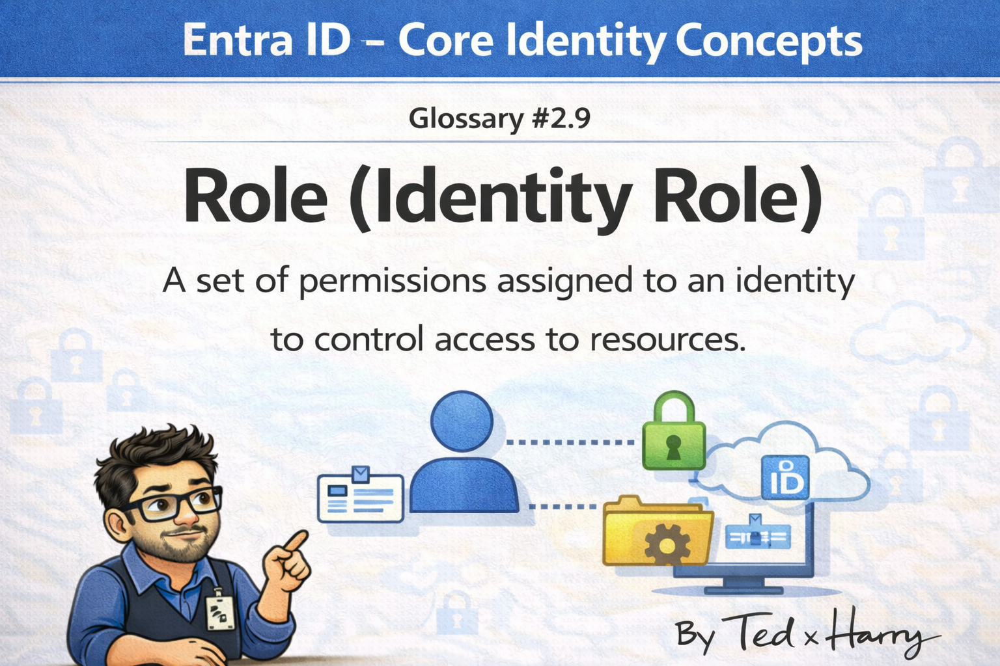

# Role (Identity Role)
*One Word, Three Completely Different Things in Entra ID*

> **Difficulty:** 🟡 Intermediate

📚 Part of Entra ID Glossary Series #2.9 - Role (Identity Role)

---

The conversation went sideways when the security architect asked, "What role does this service account have?"

The developer thought she meant app roles. The IT admin thought she meant directory roles. I thought she meant Azure RBAC roles. We all answered a different question and spent ten minutes talking past each other before someone stopped and said: "Hold on, which kind of role are we talking about?"

That meeting is a good reason to read this article.

"Role" in Microsoft identity is a heavily overloaded term. Three distinct systems use it to mean three different things. They look similar on the surface, they all describe *what something is allowed to do*. But they operate in different planes, apply to different resources, and break in different ways when misconfigured.

## 📌 Type 1: directory roles (entra ID administrative roles)

Directory roles control who can *administer Entra ID itself*. These are the roles you assign to give someone admin capabilities in the tenant, the ability to create users, manage groups, reset passwords, configure Conditional Access, read security alerts.

Examples: Global Administrator, User Administrator, Helpdesk Administrator, Privileged Role Administrator, Conditional Access Administrator.

These are tenant-scoped by default. Assign someone the User Administrator directory role and they can manage users across the entire tenant. Scope it to an Administrative Unit and they can only manage the users in that container.

Directory roles live in the identity plane. They control who manages identities and policies, not who accesses Azure resources or what an application can do inside a business application.

## 📌 Type 2: Azure RBAC roles

Azure RBAC roles control who can do what with Azure resources, virtual machines, storage accounts, key vaults, databases, App Services. The built-in roles are Owner, Contributor, and Reader at the broadest level, plus hundreds of specialized roles like Key Vault Secrets User, Storage Blob Data Reader, and Virtual Machine Contributor.

Azure RBAC assignments live on resources in your Azure subscription hierarchy, management group, subscription, resource group, or specific resource. They're completely separate from Entra ID directory roles.

Someone can be a Global Administrator in Entra ID and have no access to any Azure subscription. Someone can own an Azure subscription and have no directory role at all. These systems don't bleed into each other unless you explicitly connect them, like when you assign a managed identity an Azure RBAC role so it can access a Key Vault.

The practical confusion: teams sometimes try to fix an Azure access problem by adding directory roles (or vice versa). They're in the wrong plane entirely.

## 🔓 Type 3: app roles (application-level authorization)

App roles are the most different of the three, and the one developers encounter most directly.

An app role is a permission defined by a specific application, not by Microsoft or Azure, but by whoever built or configured the app. Your expense management tool might define roles like `Expense.Submitter`, `Expense.Approver`, and `Expense.Admin`. Your internal project tracker might have `Project.Viewer`, `Project.Editor`, `Project.Manager`.

These roles exist only within the context of that application. Entra ID doesn't inherently know what `Expense.Approver` means, only the expense app does. What Entra ID does is *deliver* the role to the application inside the user's token.

Here's the flow: the developer defines app roles in the app registration. Admins assign users or groups to those roles through the Enterprise Application. When a user signs in to the app, their token includes a `roles` claim containing every app role they've been assigned. The application reads that claim and makes authorization decisions accordingly.

The practical power: app roles let you manage application-level authorization entirely inside Entra ID, without the application needing to maintain its own user permission database. Users are in Entra ID. Role assignments are in Entra ID. Access reviews can run against them. The source of truth is centralized.

## ⚙️ How to know which one you're talking about

A quick reference:

| Question to ask | Answer points to |
|---|---|
| Can they manage users, groups, or policies in Entra ID? | Directory Role |
| Can they create, modify, or delete Azure resources? | Azure RBAC Role |
| Can they do a specific thing inside a business application? | App Role |

When someone asks "what role does this identity have?", this is the first disambiguation question. Which plane? Directory, resource, or application?

Different teams tend to own different layers. The identity team manages directory roles. Cloud infrastructure teams manage Azure RBAC. Application developers and admins manage app roles. Knowing which layer you're in tells you who to talk to when something's wrong. 🗂️

---

🔗 **Related Terms:**
- [Glossary#2.6 - Directory Role](/2%20CORE%20IDENTITY%20CONCEPTS/glossary-2-6-directory-role.md) (the Entra ID administrative roles in detail)
- [Glossary#2.8 - Permission](/2%20CORE%20IDENTITY%20CONCEPTS/glossary-2-8-permission.md) (what roles collect and assign)
- [Glossary#2.5 - Enterprise Application](/2%20CORE%20IDENTITY%20CONCEPTS/glossary-2-5-enterprise-application.md) (where app role assignments are configured)
---

💬 **Which "role" causes the most confusion in your team?** My experience is that app roles are the least understood, developers implement them but the IT admin team doesn't always know they exist. Is that true where you work?
✍️ TedxHarry

<!-- nav -->

---

[← Permission](/2%20CORE%20IDENTITY%20CONCEPTS/glossary-2-8-permission.md) | [🏠 Contents](/README) | [Delegation →](/2%20CORE%20IDENTITY%20CONCEPTS/glossary-2-10-delegation.md)
